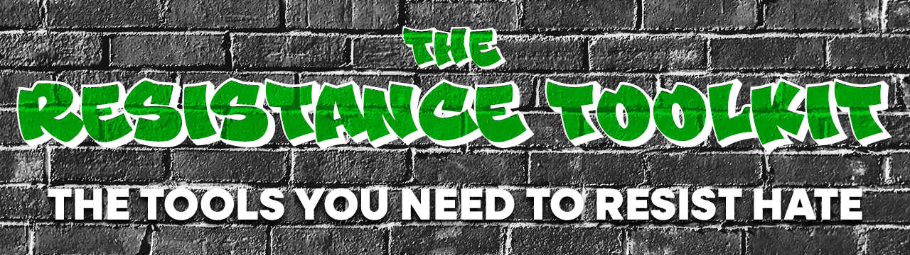

# resistance-toolkit
<!-- ## All the tools you need to resist hate.  -->

In the wake of all of the hatred being unleashed by politicians, it's easy to get overwhelmed and shut down. But please don't, that's what they are hoping we'll do! 

1. Pick [a cause](#organizations--causes) that you are passionate about.
2. Stay informed on the issues surrounding your cause.
3. Try to come up with a couple of [concrete actions](#tools) you can take to support your cause.
4. [Take breaks and recover](#recovery): this is a marathon, not a sprint! Find a relaxing hobby or take news and social media breaks. 
5. Repeat: start back at step 1. 

## Organizations & Causes
Big thanks to **Advocate** [for inspiring and seeding this list](https://www.advocate.com/politics/anti-donald-trump-charities).

**_About This List_** 

The following are excellent organizations and causes that need our help defending democracy, our fellow citizens, and our planet. They often have clear and concise action items to take to fight back. But they will also need our support, either by volunteering or by donating. 

### [Civil & Human Rights / Racism](causes/civil-rights/README.md)
### [LGBTQA+](causes/lgbtqa+/README.md)
### [Reproductive Health](causes/reproductive-health/README.md)
### [Sexism / Sexual Violence](causes/sex/README.md)
### [Immigration](causes/immigration/README.md)
### [Gun Control](causes/guns/README.md)
### [Climate Change](causes/climate/README.md)
### [Voting](causes/voting/README.md)

## Tools & Actions

### Write Your Representatives
Make your voice heard! Write to your representatives at the local and national level. Urge them to take up your cause, or call them out on stances you disagree with. 
- [Find Your Congress Members](https://www.congress.gov/members/find-your-member) 

  Enter your address to find your Senate and House representatives.
- [ResistBot](https://resist.bot)

  Resistbot is a chatbot that turns your texts into faxes, postal mail, or emails to your representatives in minutes.

### Register to Vote 
Register or checking your registration status and find out what issues are on your ballot.
- [Vote.org](https://www.vote.org/)
- [Vote Like A Beast](https://www.votelikeabeast.com/)

### Donate 
- Check if your chosen cause or organization is accepting donations.
- Find out if your organization has a membership. 
- [Charity Navigator](https://www.charitynavigator.org/)

  Charity Navigator helps millions of people take action and support the causes they care about by connecting them to the best charities that align with their passions and values.
- [Give.org](https://give.org/)

  Give.org's mission: "To strengthen public confidence in charities by promoting wise giving and trustworthy charity practices". They use a standards-based charity evaluator that seeks to verify the trustworthiness of publicly-soliciting charities by completing rigorous evaluations. 

### Volunteer
- Check if your cause or organization has volunteer openings or memberships. 
- [VolunteerMatch.org](https://www.volunteermatch.org/)

  VolunteerMatch believes that volunteering can change lives – starting with yours. When we connect with our communities and each other through service we can find our passion and purpose, build camaraderie and hope, and experience joy and gratitude. 
- [Volunteer as a Poll Worker](https://www.eac.gov/help-america-vote)

## Recovery
- [How and Why You Should Take Social Media Breaks](https://summer.harvard.edu/blog/need-a-break-from-social-media-heres-why-you-should-and-how-to-do-it/)
- [Mindfulness Activities](https://www.healthline.com/health/mind-body/mindfulness-activities#for-adults)
- [Find a Fitness Routine](https://www.mayoclinic.org/healthy-lifestyle/fitness/basics/fitness-basics/hlv-20049447)
- [Make Sure You're Getting Good Sleep](https://hub.jhu.edu/at-work/2022/03/11/good-sleep-for-good-health/)

# Contributions
Have suggestions, comments, concerns? Or maybe you have a new feature idea you'd like to see added? I want this repo to be as helpful as possible, and I need your help!

Please read the [Contributing](./CONTRIBUTING.md) doc for the types of issues or requests that are currently being accepted. 

**First time contributing to an open source project?**

In the top left corner of this page there is a tab called "Issues". Click on it to see a list of open and closed issues (issues are tasks that need to be done, requests or questions, bug reports, etc.) This is where you will where you will help contribute to this project. 