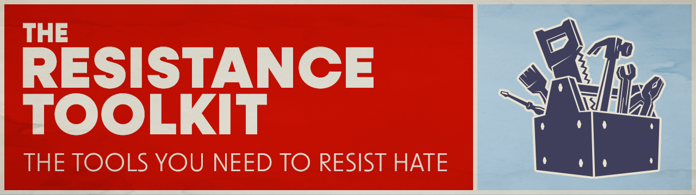

# resistance-toolkit

## TL;DR
To resist hate: [pick a cause](steps/step1/README.md), [stay informed](steps/step2/README.md), [take an action](steps/step3/README.md), [recover](steps/step4/), and [repeat](steps/step1/README.md).

## What is the Resistance Toolkit?
Learn about the creation of this project, what it's about, and its mission in the [About page](about.md).

**_Note:_** This implementation is primarily focused on **U.S. politics and issues**, but after some feedback I am working on an international version of this toolkit, because hate is obviously a global issue.

## How To Use This Project?

1. Pick [a cause](steps/step1/README.md) that you are passionate about.
2. [Stay informed](steps/step2/README.md) by following organizations that deal with your cause on social media or subscribing to their mailing lists.
3. Pick a couple of [concrete actions](steps/step3/README.md) you can take to support your cause. Or create your own tools to help yourself and others take action. 
4. [Take a break and recover](steps/step4/): this is a marathon, not a sprint! 
5. Repeat: start back at [step 1](steps/step1/README.md).   

## How To Help Develop This Project
**_Please read the [Contributing doc](./CONTRIBUTING.md)_** to see the types of issues and requests that are currently being accepted.