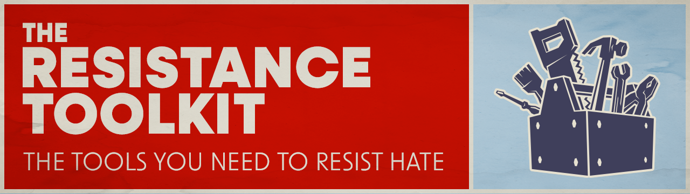

## What is the Resistance Toolkit?
Are you feeling as overwhelmed and ready to shut down as I am in the wake of all of the hatred being unleashed by politicians? 

Feeling hopeless, I realized I needed a way to channel my frustration into meaningful action. So I am developing the Resistance Toolkit in an attempt to turn outrage into progress. The mission is to create a process: pick a cause, take an action, recover, and repeat. This seemed more achievable to me then attempting to somehow tackle all of the issues at once.

I know that together, we can transform feelings of hopelessness into a movement for change. Let's build something that fights hate, one action at a time.

**_Note:_** This implementation is primarily focused on **U.S. politics and issues**, but after some feedback I am working on an international version of this toolkit, because hate is obviously a global issue.