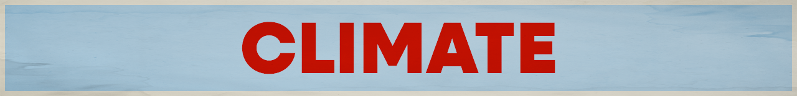

# Organizations

## 🌍 International

- [Climate Action Network](https://climatenetwork.org/)

  Climate Action Network (CAN) is the world’s largest climate network made up of more than 1,900 civil society organisations in over 130 countries, together fighting the climate crisis.

## 🇺🇸 U.S. Focused

- [Climate Science Legal Defense Fund](https://climatesciencedefensefund.org/)

  Our work ensures that scientists can conduct, publish, and discuss their research and advocate for science without the threat of political harassment, censorship, or legal intimidation.

- [Citizens' Climate Lobby](https://citizensclimatelobby.org/)

  Citizens’ Climate Lobby (CCL) is a nonprofit, nonpartisan, grassroots advocacy climate change organization focused on national policies to address the national and global climate crisis. Consistently respectful, nonpartisan approach to climate education.

